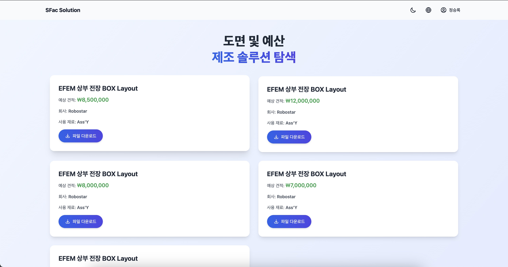
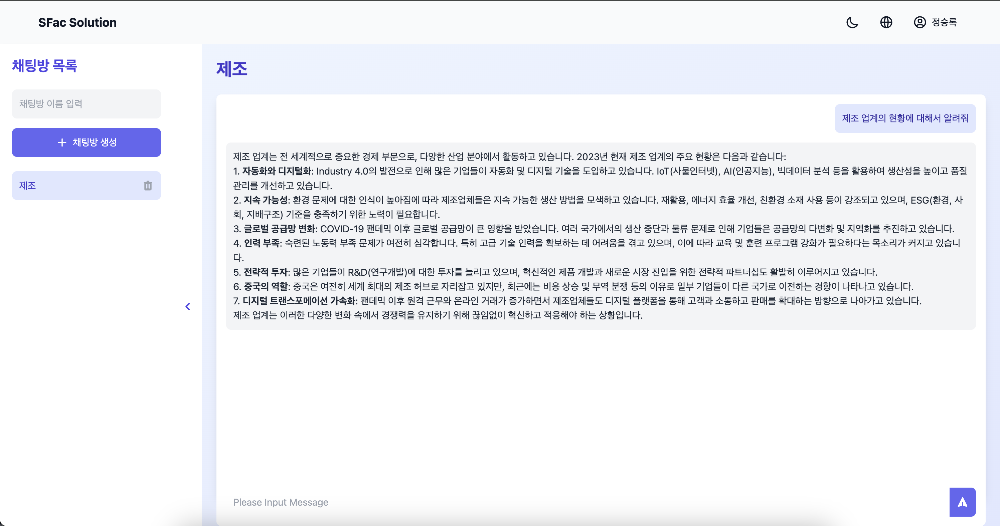

# 프론트엔드 - SFAC Solution

이 브랜치는 CAD 도면 추천 및 예상 견적 서비스를 제공하는 웹 애플리케이션의 프론트엔드 부분을 담당합니다. React를 사용하여 사용자 인터페이스를 구현하였으며, 다양한 기능을 통해 사용자에게 편리한 서비스를 제공합니다.

## 주요 기능

### 1. 사용자 인터페이스 (UI)

- **반응형 디자인**: 모든 페이지가 데스크톱과 모바일에서 적절히 표시되도록 반응형으로 설계되었습니다.
- **유저 친화적인 네비게이션**: 직관적인 UI/UX로 사용자가 쉽게 탐색할 수 있습니다.

### 2. CAD 도면 업로드 및 분석

- **도면 업로드 기능**: 사용자는 자신의 CAD 도면을 업로드할 수 있습니다.
- **실시간 도면 분석**: 업로드된 도면을 분석하여 필요한 정보를 추출합니다.

### 3. 도면 추천 시스템

- **추천 도면 목록 제공**: 분석된 데이터를 바탕으로 사용자가 필요로 하는 도면을 추천합니다.
- **필터링 및 정렬 기능**: 사용자는 추천된 도면을 다양한 기준으로 필터링하거나 정렬할 수 있습니다.

### 4. AI 챗봇 서비스

- **AI 기반 질문 응답**: 사용자가 궁금한 사항을 질문하면 AI가 실시간으로 답변을 제공합니다. 이 기능은 AI 챗봇 서비스 페이지에서 구현되었습니다.

### 5. 실시간 견적 제공

- **즉시 견적 계산**: 사용자가 선택한 도면에 대해 실시간으로 견적을 계산하여 제공합니다.

## 주요 페이지

### 1. 메인 페이지

*프로젝트의 메인 페이지 화면*

- **설명**: 사용자들이 처음 방문하는 메인 페이지

### 2. 도면 추천 페이지

*도면 추천 페이지 화면*

- **기능**: 추천 도면 목록
- **설명**: 사용자가 입력한 정보를 바탕으로 도면을 추천해줍니다.

### 3. AI 챗봇 서비스 페이지

*AI 챗봇 서비스 페이지*

- **기능**: AI 기반 질문 응답
- **설명**: 사용자가 챗봇을 통해 다양한 질문을 하고 실시간으로 답변을 받는 페이지입니다.

### 4. 예상 견적 결과 페이지

*예상 견적 결과 페이지*

- **기능**: 실시간 견적 제공
- **설명**: 추천된 도면에 대한 예상 견적을 실시간으로 제공

## 개발 환경

- **React**: 사용자 인터페이스 개발
- **Axios**: API 통신을 위한 HTTP 클라이언트
